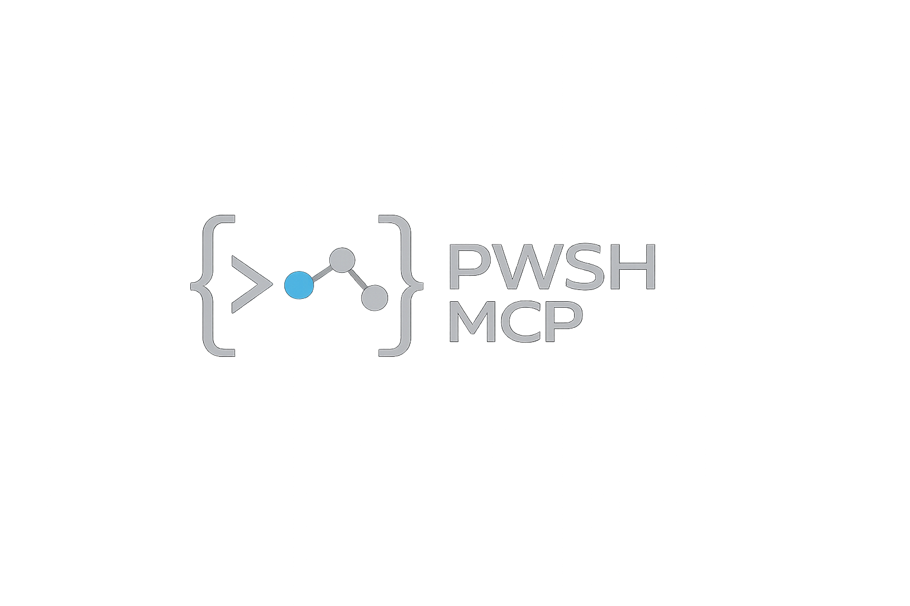

# PowerShell module for implementing a MCP Server

[](https://opensource.org/licenses/MIT)
[](https://github.com/PowerShell/PowerShell)
[](https://github.com/warm-snow-13/pwsh-mcp/actions/workflows/ci.yml)
[](https://github.com/warm-snow-13/pwsh-mcp)



PWSH MCP — Build and expose PowerShell automation as MCP tools on demand.

## Table of Contents

- [Description](#description)
- [Features](#features)
- [Architecture Overview](#architecture-overview)
- [Use Cases](#use-cases)
- [Requirements](#requirements)
- [Compatibility](#compatibility)
- [Getting Started](#getting-started)
- [Documentation](#documentation)
- [License](#license)
- [References](#references)

## Description

PowerShell MCP server module lets you build Model Context Protocol (MCP) servers directly from your own PowerShell functions. It implements an MCP server in pure PowerShell, using JSON-RPC 2.0 over stdio (stdin/stdout) and following the MCP specification.

Instead of writing a server from scratch, you describe functionality as PowerShell functions and expose them as MCP tools to MCP clients (e.g., GitHub Copilot, Gemini CLI, or GitHub Copilot CLI) through JSON-RPC 2.0 over stdio (stdin/stdout).

This approach is particularly useful for development, infrastructure management, and CI/CD automation scenarios where you already rely on PowerShell scripts and want to make them available as structured tools for AI assistants.

**Why PowerShell for MCP Servers:**

PowerShell is well-suited for implementing MCP servers for automation processes because it combines a rich automation ecosystem with native cross-platform capabilities.

- **Large module ecosystem** – You can reuse existing PowerShell modules (Azure, AWS, VMware, Active Directory, Exchange, and many others) to quickly extend MCP server capabilities without rewriting existing automation.
- **Cross-platform integration** – PowerShell 7.5+ runs natively on Windows, Linux, and macOS, making it easy to deploy the same MCP server in different environments.
- **Reuse of existing scripts** – Many automation workflows already exist as PowerShell scripts or functions; the module allows you to expose them as MCP tools with minimal changes.
- **Easy testability** – PowerShell functions can be tested independently with Pester before wiring them into MCP, simplifying debugging and iterative development.
- **Strong parameter validation** – Built-in parameter attributes provide declarative input validation, reducing boilerplate and runtime errors from invalid inputs and improving tool reliability.
- **Metadata-driven documentation** – Comment-Based Help and custom attribute (`Annotations`) let you keep function documentation and MCP schemas in sync. The same metadata is used both for human-readable help and for automatic JSON Schema generation.

## Features

- **Pure PowerShell implementation** – no external runtime dependencies, leverages native PowerShell 7.5+ capabilities.
- **Stdio-based MCP server** – compliant stdio transport implementation for seamless integration with MCP clients (GitHub Copilot, Gemini CLI).
- **Cross-platform support** – consistent behavior across platforms (Windows, Linux, macOS) with the same codebase.
- **Automatic schema generation** – converts PowerShell function parameters, validation attributes, and Comment-Based Help into JSON Schema definitions for MCP tools.
- **Parameter validation** – leverages PowerShell's declarative validation attributes for type-safe MCP tool inputs.

## Architecture Overview

The module implements the MCP lifecycle on top of stdio and JSON-RPC 2.0:

- **stdio transport** – Communication happens exclusively through stdin/stdout; no HTTP endpoints are required.
- **JSON-RPC 2.0** – Requests and responses follow the JSON-RPC 2.0 specification with strict validation and predictable error codes.
- **Tool discovery** (`tools/list`) – Discovers and exports selected PowerShell functions as MCP tools, including their schema and metadata.
- **Tool execution** (`tools/call`) – Incoming MCP tool calls are mapped to PowerShell function invocations, with automatic parameter binding and validation.
- **Initialization and shutdown** – Supports the core MCP methods (`initialize`, `shutdown`).
- **Logging and diagnostics** – Logging and diagnostics are implemented as separate components for diagnostic purposes.

**Security considerations:**

- Sanitization of incoming requests to prevent unintended command execution triggered by AI-generated inputs.
- Validation of all tool parameters to ensure they conform to expected types, ranges, and patterns.
- Leverages native PowerShell security features such as constrained language mode, script signing, and execution policies across environments.
- The MCP server can be run inside a Docker container for additional isolation when exposing automation capabilities.

## Use Cases

Typical scenarios include automating repetitive tasks, exposing existing scripts as tools for AI assistants, and integrating with local tools or cloud services:

**Rapid tool development:**

- Converting existing admin or maintenance scripts into reusable MCP tools.
- Prototyping developer utilities specific to a team or project.
- Building ad-hoc tools during a development session and immediately exposing them to AI coding assistants.

**DevOps and CI/CD automation:**

- Orchestrating deployment pipelines through MCP tools backed by existing PowerShell scripts.
- Exposing infrastructure-as-code workflows (Terraform, Ansible) via PowerShell wrappers.
- Managing build artifacts, release gates, and deployment validation steps as MCP tools.

**Infrastructure management:**

- Managing cloud resources (Azure PowerShell, AWS Tools for PowerShell, Google Cloud modules).
- Automating on-premises environments: Active Directory, Exchange, VMware, network devices, and more.
- Implementing monitoring and alerting workflows using existing PowerShell-based monitoring modules.

**Enterprise automation:**

- Integrating with external systems via REST or SDK-based PowerShell modules.
- Implementing compliance checks and audit pipelines using security-focused PowerShell modules.
- Generating reports and analytics by combining data-processing cmdlets with MCP tooling.

## Requirements

- PowerShell 7.5 or later (cross-platform)
- MCP client that supports stdio transport (Visual Studio Code with GitHub Copilot, Gemini CLI, Copilot CLI).

## Compatibility

Any MCP-compliant client that implements the MCP stdio transport and the core MCP methods should be able to connect to PowerShell MCP servers with appropriate configuration.

The PowerShell MCP server has been tested with the following MCP clients:

- [GitHub Copilot](https://code.visualstudio.com/docs/copilot/overview) – AI coding assistant.
- [GitHub Copilot CLI](https://github.com/features/copilot/cli) – command-line interface for GitHub Copilot.
- [Gemini CLI](https://geminicli.com/docs/) – interactive MCP-enabled REPL environment.

## Getting Started

The project includes ready-to-use [samples](./samples/) and configuration templates for quick start, allowing integration of PowerShell automation and AI-powered workflows into development environments within minutes. For detailed usage and advanced configurations, refer to the [documentation](./docs/pwsh-mcp.md).

1. Ensure prerequisites are installed (see [Requirements](#requirements))
2. Create a PowerShell-based MCP server
3. Add an MCP server configuration entry to your MCP client.
4. Call the MCP tools from the MCP client.

<!-- markdownlint-disable-next-line no-inline-html -->
<details>
<!-- markdownlint-disable-next-line no-inline-html -->
<summary>Simple MCP Server Example ... (click to expand) </summary>

This example shows how to expose a simple PowerShell function as an MCP tool.

⏺ **Create a PowerShell script** that defines one or more functions and imports the PowerShell MCP module.

The PowerShell MCP server sample: [samples/psmcp_hello_world.ps1](samples/psmcp_hello_world.ps1)

```powerShell
# Import the MCP server module
Import-Module pwsh.mcp -Force -ErrorAction Stop

# Define a simple Hello World function
function hello_world {
    [OutputType([System.String])]
    [CmdletBinding()]
    param (
      [Parameter(Mandatory = $false, HelpMessage = "Name to greet")]
      [string] $Name = "John Doe"
    )
    return "Hello, $Name!"
}

# Start the MCP server and pass the functions to expose.
New-MCPServer -FunctionInfo (Get-Item Function:hello_world)
```

⏺ **Add MCP Server Configuration (Visual Studio Code):**

Add new entry to your `mcp.json` file as described in the official Visual Studio Code documentation.

Example `.vscode/mcp.json` configuration for the above script:

```json
{
  "servers": {
    "mcp-pwsh-server": {
      "type": "stdio",
      "command": "pwsh",
      "args": [
        "-NoProfile",
        "-NoLogo",
        "-File",
        "${workspaceFolder}/samples/psmcp_hello_world.ps1"
      ]
    }
  }
}
```

To configure an MCP client, see the official documentation for the related client:

- [Use MCP Servers in VS Code](https://code.visualstudio.com/docs/copilot/customization/mcp-servers)
- [MCP Servers with the Gemini CLI](https://geminicli.com/docs/tools/mcp-server/)

> [!NOTE]
> GitHub Copilot CLI can reuse settings from VS Code. However, it currently does not recognize the ${workspaceFolder} template, so you should avoid using templates. Instead, provide either an absolute path in the mcp.json configuration file or a path relative to the project root.

</details>

## Documentation

- [User Guide](docs/pwsh.mcp.ug.md) - detailed documentation on using the PowerShell MCP module, including advanced configuration, schema generation, and best practices.
- [Developer Guide](docs/pwsh.mcp.dg.md) - guidelines for contributing to the project, including coding standards, testing, and CI/CD processes.

## References

- [Model Context Protocol Specification](https://modelcontextprotocol.io/specification/2025-11-25)
- [PowerShell](https://github.com/PowerShell/PowerShell)
- [PowerShell Documentation](https://learn.microsoft.com/en-us/powershell/)
- [PowerShell Cmdlet Development Guidelines](https://learn.microsoft.com/en-us/powershell/scripting/developer/cmdlet/cmdlet-development-guidelines)
- [Visual Studio Code](https://github.com/Microsoft/vscode)
- [GitHub Copilot CLI](https://github.com/features/copilot/cli)
- [Gemini CLI](https://geminicli.com/docs/)

## License

This project is licensed under the [MIT License](LICENSE).

<!-- eof -->
