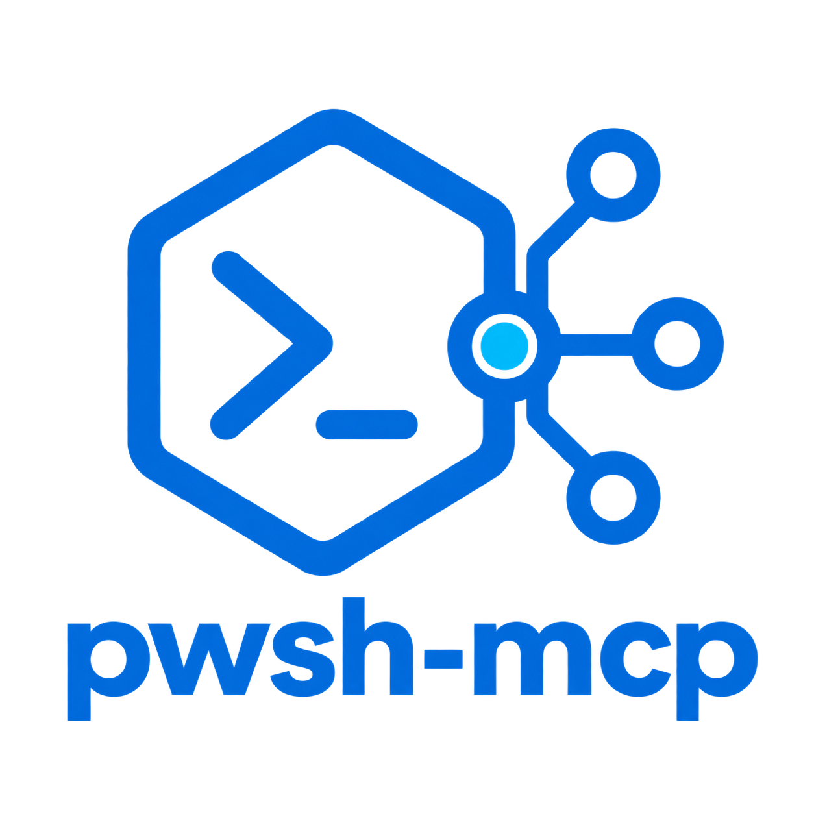

# PowerShell module for implementing an MCP server

[](https://opensource.org/licenses/MIT)
[](https://github.com/PowerShell/PowerShell)
[](https://github.com/warm-snow-13/pwsh-mcp/actions/workflows/ci.yml)
[](https://www.powershellgallery.com/packages/pwsh.mcp)
[](https://www.powershellgallery.com/packages/pwsh.mcp)
[](https://github.com/warm-snow-13/pwsh-mcp)



PWSH MCP — Build and expose PowerShell automation as MCP tools on demand.

## Table of Contents

- [Description](#description)
- [Features](#features)
- [Architecture Overview](#architecture-overview)
- [Use Cases](#use-cases)
- [Requirements](#requirements)
- [Compatibility](#compatibility)
- [Getting Started](#getting-started)
- [Documentation](#documentation)
- [License](#license)
- [References](#references)

## Description

The PowerShell MCP module lets you build Model Context Protocol (MCP) servers directly from PowerShell functions.

Instead of writing a server from scratch, you define functionality as PowerShell functions and expose it to MCP clients through JSON-RPC 2.0 over stdio transport.

**Current implementation scope:** MCP tools over stdio transport. Resources, prompts, and HTTP-based transports are not implemented.

This approach is useful for development, infrastructure management, and CI/CD automation scenarios where PowerShell scripts already exist and need to be exposed as structured tools for AI assistants.

**Why PowerShell for MCP Servers:**

PowerShell combines a mature automation ecosystem with cross-platform support.

- **Reuse existing automation** – expose established scripts and [modules](https://www.powershellgallery.com/) such as Azure, AWS, VMware, Active Directory, and Exchange tools without rewriting them.
- **Cross-platform integration** – run the same MCP server on Windows, Linux, and macOS.
- **Testable, validated tools** – test functions independently with Pester and use native parameter attributes for declarative input validation.
- **Metadata-driven schemas** – use Comment-Based Help and parameter attributes to keep documentation aligned with automatically generated JSON Schema.

## Features

- **Pure PowerShell implementation** – no external runtime dependencies, leverages native PowerShell capabilities.
- **Stdio-based MCP server** – stdio transport implementation for integration with MCP clients such as GitHub Copilot and Gemini CLI.
- **Cross-platform support** – consistent behavior across platforms (Windows, Linux, macOS) with the same codebase.
- **Automatic schema generation** – converts supported PowerShell function parameter types and Comment-Based Help into JSON Schema definitions for MCP tools.
- **Parameter validation** – leverages PowerShell's declarative validation attributes for type-safe MCP tool inputs.

## Architecture Overview

The module implements the MCP lifecycle on top of stdio and JSON-RPC 2.0:

- **stdio transport** – Communication happens exclusively through stdin/stdout; no HTTP endpoints are required.
- **JSON-RPC 2.0** – Requests and responses follow the JSON-RPC 2.0 specification with strict validation and predictable error codes.
- **Tool discovery** (`tools/list`) – Discovers and exports selected PowerShell functions as MCP tools, including their schema and metadata.
- **Tool execution** (`tools/call`) – Incoming MCP tool calls are mapped to PowerShell function invocations, with automatic parameter binding and validation.
- **Initialization and shutdown** – Supports the core MCP methods.

**Security considerations:**

- Sanitization of incoming requests to prevent unintended command execution triggered by AI-generated inputs.
- Function parameter validation ensures that inputs match the expected types, ranges, and patterns.
- Leverages native PowerShell security features such as script signing and execution policies.
- The MCP server can be run inside a Docker container for additional isolation when exposing automation capabilities.

## Use Cases

Typical scenarios include:

- **Rapid tool development** – convert existing administration scripts into reusable MCP tools or prototype team-specific utilities.
- **DevOps and CI/CD automation** – expose deployment pipelines, infrastructure-as-code workflows, build artifacts, release gates, and validation steps.
- **Infrastructure management** – manage cloud and on-premises resources, or build monitoring and alerting workflows with existing PowerShell modules.
- **Enterprise automation** – integrate REST or SDK-based systems, compliance checks, audit pipelines, reporting, and analytics.

## Requirements

- [PowerShell](https://github.com/PowerShell/PowerShell) 7.5 or later (cross-platform)
- MCP client that supports stdio transport (Visual Studio Code with GitHub Copilot, Gemini CLI, Copilot CLI).

## Compatibility

Any MCP-compliant client that implements the MCP stdio transport and the core MCP methods should be able to connect to a PowerShell MCP server with appropriate configuration.

The repository currently includes documentation and examples for the following MCP clients:

- [GitHub Copilot](https://code.visualstudio.com/docs/copilot/overview) – AI coding assistant.
- [GitHub Copilot CLI](https://docs.github.com/en/copilot/how-tos/copilot-cli/use-copilot-cli#add-an-mcp-server) – MCP server configuration.
- [Gemini CLI](https://geminicli.com/docs/) – command-line AI assistant with MCP support.
- [Claude Desktop](https://modelcontextprotocol.io/docs/develop/connect-local-servers) – local MCP server configuration.

## Getting Started

The project includes ready-to-use [samples](./samples/) and configuration templates for a quick start. For detailed usage and advanced configuration, refer to the [user guide](./docs/pwsh.mcp.ug.md) and [developer guide](./docs/pwsh.mcp.dg.md).

1. Ensure prerequisites are installed (see [Requirements](#requirements)).
2. Create a PowerShell-based MCP server.
3. Add an MCP server configuration entry to your MCP client.
4. Call the MCP tools from the MCP client.

<!-- markdownlint-disable-next-line no-inline-html -->
<details>
<!-- markdownlint-disable-next-line no-inline-html -->
<summary>Simple MCP Server Example ... </summary>

⏺ **Installation** from PowerShell Gallery

```powerShell
Install-Module -Name pwsh.mcp
```

This example shows how to expose a simple PowerShell function as an MCP tool.

⏺ **Create a PowerShell script** that defines one or more functions and imports the PowerShell MCP module.

```powerShell
# Import the MCP server module
Import-Module pwsh.mcp -Force -ErrorAction Stop

# Define a simple echo function
function get_echo {
    [CmdletBinding()]
    param (
      [Parameter(Mandatory = $false, HelpMessage = "Text to echo")]
      [string] $text = "Lorem Ipsum"
    )
    return "Echo, $text!"
}

# Start the MCP server and pass the functions to expose.
New-MCPServer -FunctionInfo (Get-Item Function:get_echo)
```

⏺ **Add an MCP server configuration (Visual Studio Code):**

Add a new entry to your `mcp.json` file as described in the official Visual Studio Code documentation.

Example `.vscode/mcp.json` configuration for the above script:

```json
{
  "servers": {
    "mcp-pwsh-server": {
      "type": "stdio",
      "command": "pwsh",
      "args": [
        "-NoProfile",
        "-NoLogo",
        "-File",
        "${workspaceFolder}/path/to/your/script.ps1"
      ]
    }
  }
}
```

The file path can be absolute or relative to the workspace folder.

Refer to the [user guide](./docs/pwsh.mcp.ug.md) for additional examples and advanced configuration.

To configure an MCP client, see the official documentation for the related client:

- [Use MCP Servers in VS Code](https://code.visualstudio.com/docs/agent-customization/mcp-servers)
- [MCP Servers with the Gemini CLI](https://geminicli.com/docs/tools/mcp-server/)

⏺ **Call the MCP tool** from your MCP client (e.g., GitHub Copilot in Visual Studio Code):

```text
#get_echo text="Hello, MCP!"
```

</details>

## Documentation

- [User Guide](docs/pwsh.mcp.ug.md) – detailed usage documentation, including advanced configuration, schema generation, and best practices.
- [Developer Guide](docs/pwsh.mcp.dg.md) – contribution guidance, including coding standards, testing, and CI/CD processes.

## References

- [Model Context Protocol Specification](https://modelcontextprotocol.io/specification/2025-11-25)
- [PowerShell](https://github.com/PowerShell/PowerShell)
- [PowerShell Documentation](https://learn.microsoft.com/en-us/powershell/)
- [PowerShell Cmdlet Development Guidelines](https://learn.microsoft.com/en-us/powershell/scripting/developer/cmdlet/cmdlet-development-guidelines)
- [Visual Studio Code](https://github.com/Microsoft/vscode)
- [GitHub Copilot CLI MCP configuration](https://docs.github.com/en/copilot/how-tos/copilot-cli/use-copilot-cli#add-an-mcp-server)
- [Gemini CLI](https://geminicli.com/docs/)

## License

This project is licensed under the [MIT License](LICENSE).

<!-- eof -->
