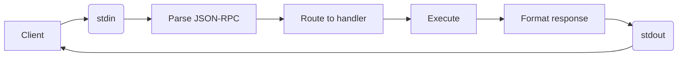

# Developer Guide

## Getting Started

### Prerequisites

- PowerShell 7.5 or later
- Visual Studio Code (recommended for development)
- Visual Studio Code extensions:
  - PowerShell (ms-vscode.powershell)
  - Pester Tests (pspester.pester-test)

Recommended extensions are listed in [.vscode/extensions.json](../.vscode/extensions.json).

### Clone Repository

```bash
git clone https://github.com/warm-snow-13/pwsh-mcp.git ps-mcp-server
cd ps-mcp-server
```

### Install Dependencies

Required modules for development:

```powershell
# Install testing framework
Install-Module -Name Pester -Force

# Install static analyzer
Install-Module -Name PSScriptAnalyzer -Force
```

## Project Structure

```text
/root
├── src/                         # Source code
│   ├── server1.ps1              # Example server
│   └── pwsh.mcp/
│       ├── pwsh.mcp.psd         # Module manifest
│       ├── pwsh.mcp.psm1        # Module loader
│       ├── psmcp.core.ps1       # Core MCP implementation
│       ├── psmcp.helper.ps1     # Helper functions
│       └── psmcp.logger.ps1     # Logging subsystem
│
├── tests/                       # Pester tests
│   └── ...
├── samples/                     # Examples of MCP servers
│   └── ...
├── scripts/                     # Automation scripts
│   └── PSCoreUtils/             # Utility module
│
├── .vscode/                     # VS Code configuration
│   ├── tasks.json               # Pre-configured tasks
│   ├── launch.json              # Debug configurations
│   ├── settings.json            # Workspace settings
│   └── extensions.json          # Recommended extensions
│
├── docs/                        # Documentation
│   ├── pwsh.mcp.ug.md           # User guide
│   └── pwsh.mcp.dg.md           # Developer guide
│
├── ci.ps1                       # CI script
├── ci.settings.psd1             # CI configuration
│
├── config.analyzer.psd1         # PSScriptAnalyzer settings
├── config.tests.psd1            # Pester configuration
│
├── jarvis.ps1                   # automation script
│
├── Makefile                     # Makefile for common tasks
└── README.md                    # Project overview
```

## MCP Server Implementation Example

**File:** `samples/psmcp_hello_world.ps1`

This is a simple example of an MCP server implemented in PowerShell. It defines a single function `hello_world` that takes a name as input and returns a greeting message. The server is created using the `New-MCPServer` cmdlet from the `pwsh.mcp` module, which takes the function information as an argument.

```powershell
function hello_world {
    <#
    .SYNOPSIS
    A simple Hello World function.
    #>
    [Annotations(Title = "Hello World", ReadOnlyHint = $true)]
    param(
        [Parameter(HelpMessage = "Name to greet")]
        [ValidateLength(0, 25)]
        [string] $Name = "World"
    )
    return "Hello, $Name!"
}

Import-Module pwsh.mcp -Force -ErrorAction Stop
New-MCPServer -FunctionInfo (Get-Item Function:hello_world)
```

Note: Annotations are used to provide metadata for the MCP server, such as the title and read-only hint. Refer to the `Annotations` attribute class defined in`src/pwsh.mcp/classes/AnnotationsAttribute.cs`.

## VS Code MCP Server Configuration

The MCP server can be configured in Visual Studio Code using the `mcp.json` file. This file defines the servers that VS Code will manage, including how to start them and any environment variables needed.

**Configuration file:** `.vscode/mcp.json`

**Full schema:**

```jsonc
{
  "servers": {
    "server-name": {
      "type": "stdio",                          // Required: transport type
      "command": "pwsh",                        // Required: executable
      "args": [                                 // Required: command arguments
        "-NoLogo",
        "-NoProfile",
        "-File",
        "${workspaceFolder}/samples/psmcp_hello_world.ps1"
      ],
      "env": {                                  // Optional: environment variables
        "PWSH_MCP_SERVER_LOG_LEVEL": "DEBUG",
        "PWSH_MCP_SERVER_LOG_FILE_PATH": "${workspaceFolder}/logs/psmcp_hello_world.log"
      },
      "dev": {                                  // Optional: development features
        "watch": "src/**/*.ps1"                 // Hot-reload on file changes
      }
    }
  },
  "inputs": []                                  // Optional: user inputs
}
```

Check the actual configuration in [.vscode/mcp.json](../.vscode/mcp.json).

**Reference:** [VS Code MCP Configuration](https://code.visualstudio.com/docs/copilot/customization/mcp-servers#_configuration-format)

## Development Workflow

### 1. Make Changes

Edit source files in `src/pwsh.mcp/`:

- `psmcp.core.ps1` - Core MCP protocol implementation
- `psmcp.helper.ps1` - Schema generation and utilities
- `psmcp.logger.ps1` - Logging functionality

### 2. Run Tests

```powershell
# Run all tests
pwsh -NoProfile -NoLogo -File ./ci.ps1 -action test

# Run specific test file
Invoke-Pester -Path ./tests/psmcp.core.tests.ps1
```

### 3. Code Analysis

```powershell
# Run PSScriptAnalyzer
pwsh -NoProfile -NoLogo -File ./ci.ps1 -action analyze
```

## Testing

The project uses the [Pester](https://pester.dev/) framework for unit testing.

**Configuration:** [config.tests.psd1](../config.tests.psd1)

```powershell
# Run all tests with coverage
Invoke-Pester -Configuration (Import-PowerShellDataFile './config.tests.psd1')

# Run specific test
Invoke-Pester -Path ./tests/psmcp.core.tests.ps1 -Output Detailed

# Run tests matching pattern
Invoke-Pester -Path ./tests/ -TagFilter 'unit'
```

CI stores coverage and test results in [coverage/TestCoverage.xml](../coverage/TestCoverage.xml) and [coverage/TestResult.xml](../coverage/TestResult.xml).

The project includes pre-configured [tasks](../.vscode/tasks.json) for
Visual Studio Code.

Open the Command Palette: `Cmd+Shift+P` → `Tasks: Run Task` → Select `CI: Unit Tests`
to run the unit tests.

**Test Conventions:**

- Place tests in `tests/` directory
- Name test files: `<component>.tests.ps1`
- Follow Arrange-Act-Assert pattern

## Code Analysis

The project uses [PSScriptAnalyzer](https://github.com/PowerShell/PSScriptAnalyzer) for static code analysis.

The ruleset is defined in the [config.analyzer.psd1](../config.analyzer.psd1).

To check the project codebase with configured rules:

```powershell
Invoke-ScriptAnalyzer -Path ./src -Settings ./config.analyzer.psd1 -Recurse
```

To check a specific file with default rules:

```powershell
Invoke-ScriptAnalyzer -Path ./src/pwsh.mcp/psmcp.core.ps1 -Settings ./config.analyzer.psd1
```

The project includes pre-configured [tasks](../.vscode/tasks.json) for
Visual Studio Code.

Open the Command Palette: Press `Cmd+Shift+P` → `Tasks: Run Task` → `CI: Code Analysis` to run the code analysis.

### Code Style Guidelines

Follow [PowerShell Best Practices](https://learn.microsoft.com/en-us/powershell/scripting/developer/cmdlet/cmdlet-development-guidelines):

- Use Verb-Noun naming convention for public functions
- Use approved verbs: `Get-`, `Set-`, `New-`, `Remove-`, etc.
- Add Comment-Based Help to all public functions
- Use parameter validation attributes
- Use `PascalCase` for function names and `camelCase` for variables
- Handle errors appropriately (try/catch)
- Write self-documenting code

## CI/CD

### CI Script

Unified entry point: [ci.ps1](../ci.ps1)

```powershell
# Run tests
./ci.ps1 -action test

# Run code analysis
./ci.ps1 -action analyze
```

### GitHub Actions

Workflow: [.github/workflows/ci.yml](../.github/workflows/ci.yml)

Triggers:

- Push to `main` branch
- Pull requests
- Manual workflow dispatch

Actions: `PowerShell CI` runs the following jobs:

- **test** - Run Pester tests on multiple platforms
- **analyze** - Run PSScriptAnalyzer with configured rules

### Local CI Simulation

Run the same checks as CI locally:

```powershell
# Run tests with verbose output
./ci.ps1 -action test -Verbose

# Run code analysis (fail on errors)
./ci.ps1 -action analyze -Verbose

# Run static analysis (fail when warnings are found)
./ci.ps1 -action analyze -FailOnWarnings

```

## Architecture

### Core Components

#### Stdio Transport

**Module implements stdio-based communication:**

- Read `JSON-RPC` requests from stdin
- Writes `JSON-RPC` responses to stdout

#### JSON-RPC 2.0

Compliant with [JSON-RPC 2.0 specification](https://www.jsonrpc.org/specification):

- Request/Response format
- Error codes and messages
- Notification support

#### MCP Protocol

[MCP specification 2025-11-25](https://modelcontextprotocol.io/specification/2025-11-25).

Operations implemented:

- `initialize` - Server capabilities negotiation
- `tools/list` - Tool discovery
- `tools/call` - Tool execution
- `shutdown` - Graceful shutdown

### Request Flow



### Schema Generation

PowerShell metadata → JSON Schema conversion:

1. Parse function `FunctionInfo` object
2. Extract parameters and attributes
3. Convert validation attributes to JSON Schema
4. Generate tool definition with schema

## Development Environment

### Makefile

The top-level [Makefile](../Makefile) wraps common CI actions: `make test` and `make ci-action-test` call `ci.ps1 -action test`, `make ci-action-analyze` runs analyzer, and `make build` / `make deploy` proxy the Jarvis automation script for packaging or local install.

### VS Code Workspace Settings

**File:** `.vscode/settings.json`

```jsonc
{
  "powershell.scriptAnalysis.enable": true,
  "powershell.scriptAnalysis.settingsPath": "config.analyzer.psd1",
}
```

The workspace settings point Script Analyzer to [config.analyzer.psd1](../config.analyzer.psd1) via `powershell.scriptAnalysis.settingsPath` to keep local diagnostics aligned with CI.

Coverage visualization is enabled through the `coverage-gutters` extension (configured in [.vscode/settings.json](../.vscode/settings.json)) and consumes `coverage/TestCoverage.xml` generated by Pester (configured in [config.tests.psd1](../config.tests.psd1)).

### VS Code Tasks

**File:** `.vscode/tasks.json`

**Predefined tasks:**

- `CI: Unit Tests` - Run Pester tests
- `CI: Code Analysis` - Run PSScriptAnalyzer
- `AUTOMATION: jarvis: build` - Build automation: create module package with incremented version
- `AUTOMATION: jarvis: deploy` - Deploy automation: install module locally

To execute a task, open Command Palette: `Cmd+Shift+P` → `Tasks: Run Task` → Select desired task (e.g., `CI: Unit Tests`)

### Launch Configurations

**File:** `.vscode/launch.json`

**Debug configurations for:**

- MCP server debugging
- Pester test debugging
- Script debugging

## Contributing

### Before Submitting PR

1. **Run tests:** `./ci.ps1 -action test`
2. **Run analyzer:** `./ci.ps1 -action analyze`
3. **Update CHANGELOG.md** with your changes
4. **Write/update tests** for new functionality
5. **Update documentation** if needed

### Release Checklist

A short checklist to perform before cutting a release or publishing a package:

- Run full tests: `./ci.ps1 -action test`
- Run static analysis: `./ci.ps1 -action analyze`
- Update `CHANGELOG.md` and bump version metadata if applicable
- Verify documentation and sample paths (`mcp.json`, `samples/`) are correct
- Build/package the module (if releasing an artifact) and smoke-test
- Create a Git tag (semver) and push tags to `origin`

### Commit Messages

Follow [Conventional Commits](https://www.conventionalcommits.org/):

Use `type(scope): subject` with a concise imperative subject (≤72 characters). Examples: `fix(core): handle empty tool list`, `feat(logger): add structured context`. Mark breaking changes with `!` (for example, `feat(api)!: drop legacy params`) and explain the breaking change in the commit body. Typical types: `feat`, `fix`, `chore`, `refactor`, `docs`, `test`, `build`, `ci`.

### Code Review Process

1. Create feature branch: `git checkout -b feature/my-feature`
2. Make changes and commit
3. Push to GitHub: `git push origin feature/my-feature`
4. Create Pull Request
5. Address review comments
6. Merge after approval

## Resources

- [MCP Specification](https://modelcontextprotocol.io/specification/2025-11-25)
- [JSON-RPC 2.0](https://www.jsonrpc.org/specification)
- [PowerShell Documentation](https://learn.microsoft.com/powershell/)
- [Pester Documentation](https://pester.dev/)
- [PSScriptAnalyzer Rules](https://github.com/PowerShell/PSScriptAnalyzer/tree/main/docs/Rules)
- [Cmdlet Development Guidelines](https://learn.microsoft.com/powershell/scripting/developer/cmdlet/cmdlet-development-guidelines)
